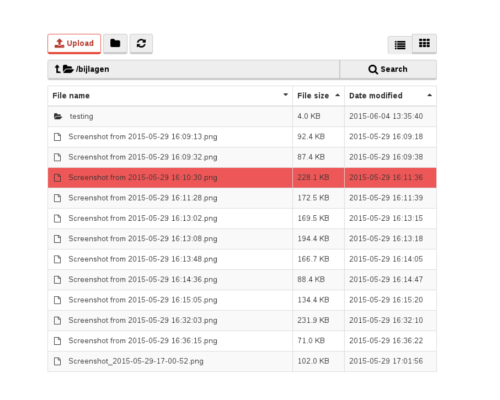

RecognizeFilemanagerBundle
========================



This bundle allows you to use a custom filemanager that works simular to Moxiemanager.
It gives users the option to organize files withouts links in the database breaking as long as
the managing is done through the filemanager apis.

It has the following benefits over Moxiemanager:

* Customizable API paths
* Deep Symfony2 integration
* Form widget that can select and upload files to the filesystem with a working fallback if javascript is disabled
* Configurable security options for actions like opening directories and deleting files based on user roles
* Directory level ACLs that can grant or disallow actions for user roles or users.
* HTML that can laid out in any way you want, giving you full flexibility over the styling and the UI

The widget has been tested on IE9 and above, as well as Firefox, Chrome and Safari.
It also works on mobile, and extra care has been taken to ensure that it works with just keyboard navigation as well.

Installation
-----------

Add the bundle to your composer.json

```json
# composer.json
{
	"repositories": [
		{
			"type": "git",
			"url":  "git@bitbucket.org:recognize/filemanager-bundle.git"
		}
	],
	 "require": {
		"recognize/filemanager-bundle": "dev-master",
	}
}
```

Run composer install

```sh
php ./composer.phar install
```

Enable the bundle in the kernel

```php
	<?php
	// app/AppKernel.php

    public function registerBundles()
    {
        $bundles = array(
            // ...
            new Recognize\FilemanagerBundle\RecognizeFilemanagerBundle(),
        );
    }
```

Add the form widget and add the example config.yml contents from the Resources/config folder
to the app config.yml

```yml
// app/config.yml
twig:
	form:
		resources:
			- 'RecognizeFilemanagerBundle::widget.html.twig'
			
recognize_filemanager:
	directories:
		default: /var/www/Filemanager/app/cache
		example_directory: /var/www/Filemanager/app/cache/example
    api_paths:
        read: _fileapi_read
        create: _fileapi_create
        upload: _fileapi_create
        rename: _fileapi_rename
        move: _fileapi_move
        delete: _fileapi_delete
        download: _fileapi_download
        preview: _fileapi_preview

    security:
        actions:
            open: [ ROLE_USER ]
            upload: [ ROLE_USER ]
            create: [ ROLE_USER ]
            move: [ ROLE_USER ]
            rename: [ ROLE_USER ]
            delete: [ ROLE_USER ]
```

Finally, add a new Controller class with routes that serves as the API entrance.

```php
class FileController extends FilemanagerController {

    /**
     * @return FilemanagerService
     */
    protected function getFilemanager(){
        $manager = parent::getFilemanager();
        return $manager;
    }

    /**
     * @Route("/fileapi", name="_filemanager_read")
     * @param Request $request
     */
    public function read(Request $request){
        return parent::read( $request );
    }

    /**
     * @Route("/fileapi/search", name="_filemanager_search")
     * @param Request $request
     */
    public function search(Request $request){
        return parent::search( $request );
    }

    /**
     * @Route("/fileapi/create", name="_filemanager_create")
     * @param Request $request
     */
    public function create(Request $request) {
        return parent::create( $request );
    }

    /**
     * @Route("/fileapi/move", name="_filemanager_move")
     * @param Request $request
     */
    public function move(Request $request) {
        return parent::move( $request );
    }

    /**
     * @Route("/fileapi/rename", name="_filemanager_rename")
     * @param Request $request
     */
    public function rename(Request $request) {
        return parent::rename( $request );
    }

    /**
     * @Route("/fileapi/delete", name="_filemanager_delete")
     * @param Request $request
     */
    public function delete(Request $request) {
        return parent::delete( $request );
    }

    /**
     * @Route("/fileapi/preview", name="_filemanager_preview")
     * @param Request $request
     */
    public function preview(Request $request) {
        return parent::preview( $request );
    }

    /**
     * @Route("/fileapi/download", name="_filemanager_download")
     * @param Request $request
     */
    public function download(Request $request) {
        return parent::download( $request );
    }
}
```

Configuration
--------------

The configuration in the app config should give you an example of the options you have at your disposal.

**Working directories**

First up is the directories array. 
This array contains all the possible absolute paths that can be served as working directories for the filemanager.
The default option is always used if no directory has been explicitly set.

The working directory can be changed during runtime in your FileController in the getFilemanager method. 
This can be useful if you want to show a different set of folders for users and admins.

```php
// FileController.php
    
    /**
     * @return FilemanagerService
     */
    protected function getFilemanager(){
        $manager = parent::getFilemanager();
        
        $securityContext = $this->get('security.context');
        if( $securityContext->isGranted('ROLE_USER') ){
            $manager->setWorkingDirectory( "example_directory" );
        }
        return $manager;
    }


```

**Api paths**

The api paths can be changed individually. 
They should be path names responding to a path that exists in the router.

**Security**

In the security node of the configuration you can see an action array. 
This is a key value pair responding to an action and an array of the roles that are allowed to use it.
Any user role that isn't in the array will be denied access unless this is overwritten in the ACLs.

In this example, only admins are allowed to move directories

```yml
// app/config.yml
recognize_filemanager:
    security:
        move: [ ROLE_ADMIN ]
```

Documentation
-------------


Testing PHP
--------------

To set up the testing enviroment you have to do two things

  * [Install phpunit][1]

[1]:  https://phpunit.de/manual/current/en/installation.html

After this, you can simply run the following command to test all the files.

```sh
phpunit --testsuite all
```

NOTE: This testsuite requires a testdatabase. If you just want to test the units without a database, run the following command.

```sh
phpunit --testsuite unit
```

Testing javascript
------------------------

First, make sure you have npm and the dependencies installed on your machine.
Use the following command to get the dependencies after retrieving npm

```sh
npm install
```

Then, you can run the following command to test the javascript

```sh
grunt jasmine
```

